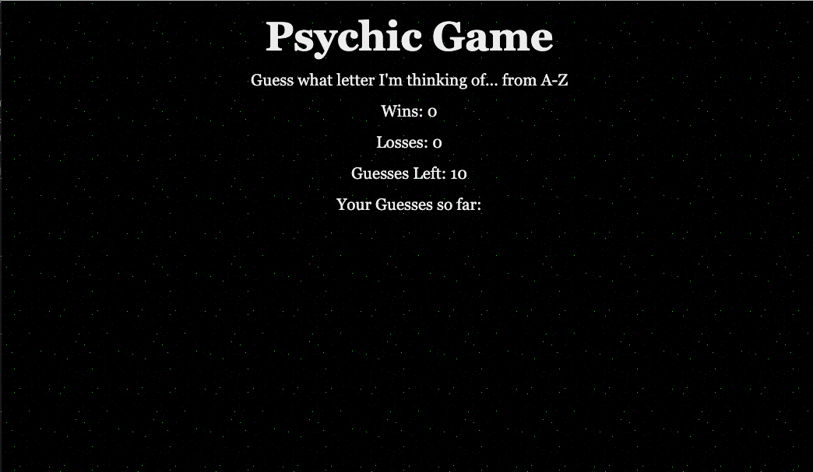

# Psychic Game

# Introduction

I built a guessing game built using JavaScript. The instructions are below along with a GIF. I was able to add in a method which only allows the player to press a key from a-z and I added in a caps lock override. 

 ## Summary

This was my first JavaScript project. 

 ## Technologies Used
 - HTML
 - CSS
 - Git
 - Github
 - JavaScript

 ## Instructions

 ##### How to play:

 - Select a letter from a-z
 - You have 10 guesses to get it right
 - If you get it right, the game automatically restarts and your wins go up by 1
 - If you get through all 10 guesses without winning, your losses will go up by 1

